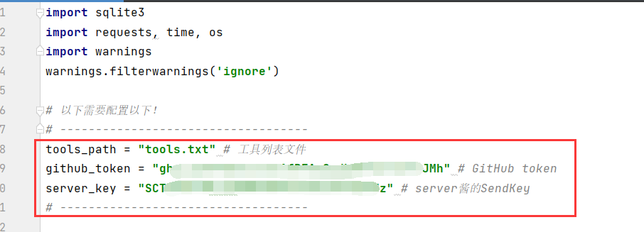
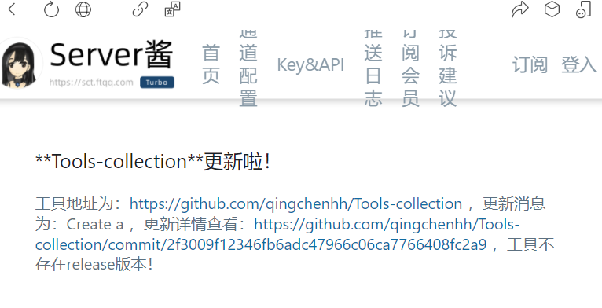

# GitHub工具监测小脚本

其实网上有好些脚本了，比如yhy0大佬的：https://github.com/yhy0/github-cve-monitor

我是参考了他的工具，因为我原先也不知道GitHub更新机制可以从GitHub的api中获取到信息，然后判断。

---

为啥有这个工具？就是当时使用yhy0大佬的工具的时候我只是单纯的想监控工具，不想监控什么关键字呀什么用户呀之类的。然后还发先跑起来的时候有两个工具一直在重复推送消息给我（后来发现是同名工具导致的），然后就想自己写一个，毕竟大佬的代码太复杂了不想看呀，其次也想自己尝试一下写写。

我这个工具就比较low了，只能做到工具监测，而且只能server酱推送。

因为我觉得server酱方便，我是想推送微信的，但是看着大佬的工具只有企业微信，钉钉，我们公司又不用钉钉，钉钉还要配置什么机器人啥的好像是这样，瞬间感觉不想弄，然后就看了一下server酱是啥东西，原来登录关注一下公众号就可以根据接口推送公众号也会给你发消息(不过每天免费5条)，感觉简单多了，适合我这种垃圾。

# 工具的使用

需要装一下requests库，使用了清华大学的镜像，快一些，命令如下：

```
pip install requests -i https://pypi.tuna.tsinghua.edu.cn/simple/ --trusted-host pypi.tuna.tsinghua.edu.cn
```

然后把工具一行一个的写道tools.txt中。

配置一下GitHub的token和server酱的SendKey就好了。

github的token怎么获取可以百度。



最后使用放到服务器上，用nohup在后台跑着就行了，命令如下：

```
nohup python3 github_monitor.py &
```

# 测试结果



