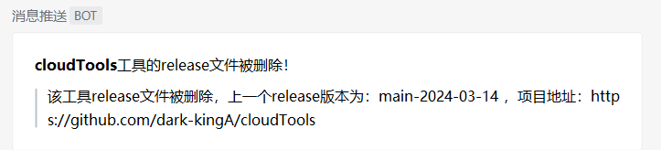

# GitHub工具监测小脚本

推送支持server酱、企业微信机器人、钉钉机器人。

优点：

1. 不同作者的同名工具，不会冲突，引发混乱推送。
2. 项目404或者项目删除了release版本也会推送。

# 工具的使用

需要装一下requests库，使用了清华大学的镜像，快一些，命令如下：

```
pip install requests -i https://pypi.tuna.tsinghua.edu.cn/simple/ --trusted-host pypi.tuna.tsinghua.edu.cn
```

然后把工具一行一个的写道tools.txt中。

配置一下GitHub的token和server酱、企业微信机器人、钉钉机器人其中一种的SendKey就好了。

github的token怎么获取可以百度。


最后使用放到服务器上，用使用计划任务跑着就行了，因为我监测的工具列表有点多，因此我设置为1小时执行一次，如果时间太短，上一次没执行完，下一次就开始执行了，不好，反正工具监测嘛，有实时性，但是没有必要那么精准，命令如下：

```
0 * * * * python3 /root/qingchen/github_monitor/github_monitor-me.py >> /root/qingchen/github_monitor/results.txt 2>&1
```

# 测试结果


